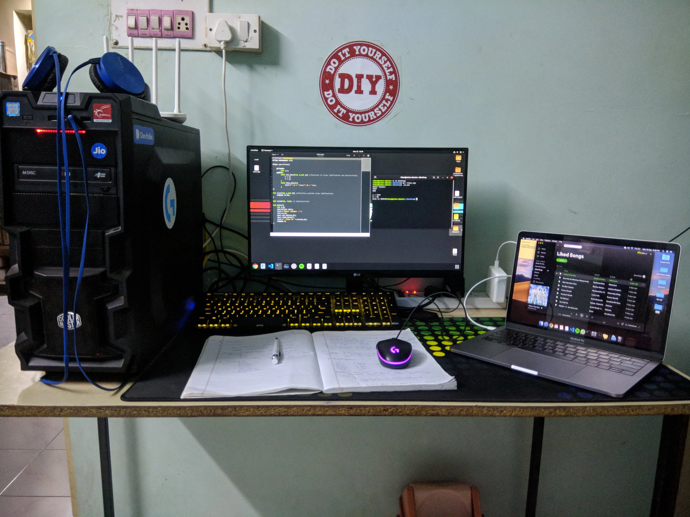

### What I did ??
I am a third-year engineering student. In my case, I didn’t have anything in my first year. I have built a Desktop computer in my 3rd SEM because I am into gaming and I bought a laptop in my fifth SEM. And yeah! It was a MacBook Pro 13" 16GB/256GB (2019) model. This is how my setup looks like.

Ok enough show off! Now let's talk about …

### What you should do …
I think you should buy A computer in your first year or at least in your second sem. Because it will give you enough hands-on experience with that machine. Frankly speaking, you don’t need a computer until your second year but its ok to have one.