### What I did ??
I am a third-year engineering student. In my case, I didn’t have anything in my first year. I have built a Desktop computer in my 3rd SEM because I am into gaming and I bought a laptop in my fifth SEM. And yeah! It was a MacBook Pro 13" 16GB/256GB (2019) model. This is how my setup looks like.

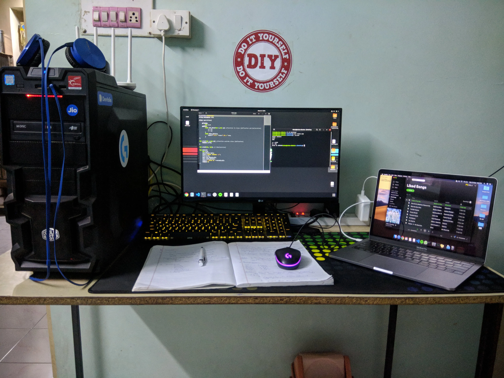

Ok enough show off! Now let's talk about …

### What you should do …
I think you should buy A computer in your first year or at least in your second sem. Because it will give you enough hands-on experience with that machine. Frankly speaking, you don’t need a computer until your second year but its ok to have one.

### What you want exactly ?? (Specifications)

#### CPU 

You know there are 2 companies who make CPU for mobile computing devices (I am talking about laptops) Intel and AMD.

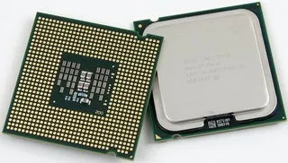

2–3 years back AMD was not even there in the laptop market. Intel was the only option for laptops. But now in 2020, AMD launched their CPUs ZEN2 architecture which smoked intel in every aspect like efficiency, performance, thermals, etc. This is the first time in history that AMD out-perform Intel CPUs in both Desktop and Laptop platforms because they are using the 7nm manufacturing process and Intel is stuck on 10nm. So now you know basic about the CPU market.

##### Intel
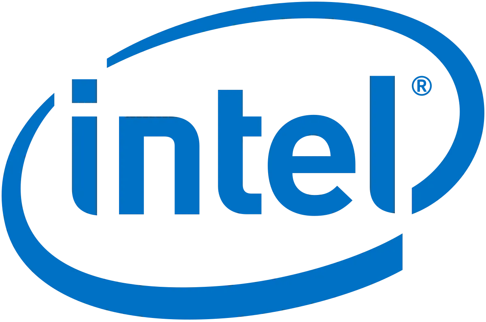

You can find different CPU models in Intel lineups like Core i3, Core i5, Core i7, and Core i9. So as a student we will only talk about Core i5 and Core i7, forget about i3 and i9 they are not for us.

So, its obvious that i7 is better than i5 right? Yes… and No. Let me explain,

We are talking about laptops, in laptops unlike desktop CPUs are very close to each other in performance. i5 comes with 4 cores and 8 threads and some i7 also come with same core count and thread count actually they are same CPUs just having slight changes. But still, i7 has its name so it sells for a higher profit margin. Hence, mostly go with Core i5s because you will find 5%-6% performance improvement which you won’t notice in day to day tasks.

You also notice some alphabets in CPU names like i5–8250U, i7–7700HQ what it stands for? read this article for more

SOLVED: What Do The Suffix Letters on Intel Processors Mean
Intel used to have a pretty simple naming scheme for its CPU's but as the market demanded more features, Intel started…
www.urtech.ca

mostly prefer U series or H series processors with 4 cores minimum.

##### AMD

AMD has their own lineup for laptop CPUs Ryzen 3, Ryzen 5, Ryzen 7, and Ryzen 9. You know what they are trying to say with their naming scheme.

Now, there are very limited laptops from brands with AMD CPUs because they are new in the market and manufacturers want to optimize their software and hardware according to AMD. So in the future, you will see some more AMD powered laptops consider them as well.

#### RAM   

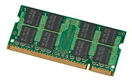

How much RAM do you want as a student? my answer will be more than or minimum 8GB. If you see a laptop with 4GB or 6GB RAM run away from it. Normal day to day tasks like internet browsing, watching movies, playing games with some programming IDEs like Android Studio, XCode, etc and some productivity applications like MSOffice, MS paint, etc will work fine with 8GB of RAM. But more is better don't go beyond 16GB its a waste of money and overkill for a student.

You will see some other info about RAM like LPDDR3, DDR4 these are types or you can say generations of RAMs. Stands for Double Data Rate (DDR). And RAM also has frequencies like 2133Mhz, 2400MHz, 3000MHz, these are working frequencies of ram that tell you how fast it can respond to your processor. anything beyond 2133MHz or DDR3 is enough but again higher is better.

#### — GPU —

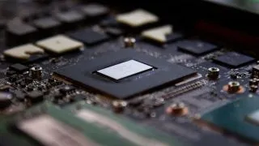

Now it's all about your preferences. You can see GPUs from Intel, Nvidia, and AMD. Nvidia and AMD have their dedicated GPUs it means a physical other CPU that helps your CPU to render graphics on the screen. And intel has its integrated GPUs that come with their CPUs built-in for performing basic graphics processing.

It's very simple if you play a “lot” of games go with Nvidia GTX or AMD Radeon series. But it will affect your battery life because here we are talking about mobile computing devices which run on the battery. And these dedicated GPUs are very power hungry some of them and not even run on battery they need a continuous power supply from the wall. And if you play some casual games then go with Nvidia MX series of GPUs they are not that heavy on your battery and they are decently powerful for most of the tasks. But if you don't know what is gaming on a computer and you don’t care about that then you may feel happy with Intel HD or Intel Iris Plus GPUs.

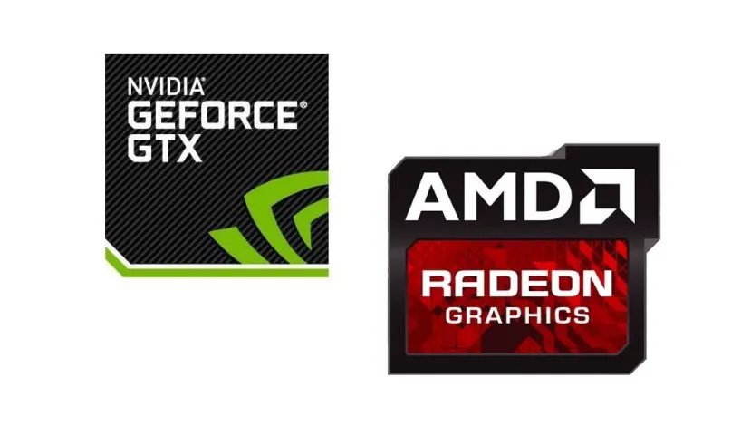

#### — Storage —

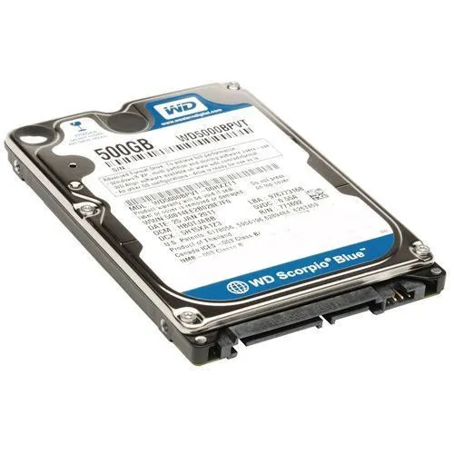

In a computer, there are two types of storage devices first is Mechanical Hard Drives(HDDs) which work on spinning disk and moving arm which reads and writes on the disk with help of magnetic field. But this has 2 important drawbacks it is extremely slow for a modern computer and it is fragile because of mechanical moving parts in it.

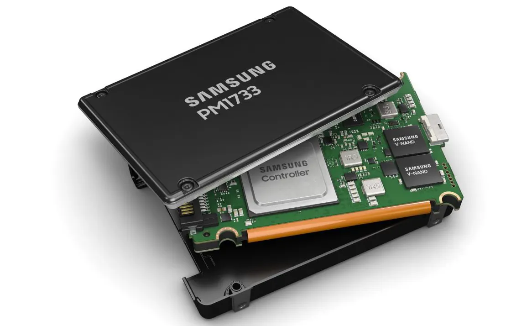

The second type is Solid State Drive(SSDs). Which is flash storage like pen drives it doesn’t have moving parts in it and it's about 10x faster than traditional HDDs. It helps you to boot faster like literally in 10 secs, your computer will feel snappy and responsive. So prefer SDDs over hard drive anytime. Or at least go with the combination of SSD and HDD, put your OS in SSD and other data like movies, games on HDD.

#### — Display —
This is as important as CPU, GPU or Storage because you will stare at it always. Most people ignore displays while purchasing a laptop.

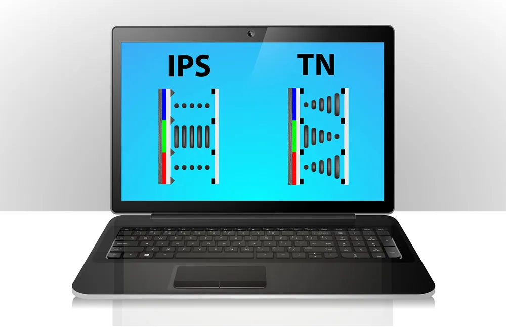

Resolution: It’s the number of pixels present on your screen and this represents with numbers like 1920X1080, 1080p and Full HD, 2k, 4k, etc. Its a very deep topic but let me give you a basic idea about this. Try to get more than Full HD, 1080p or 1920X1080 (its all same).
Display Technology: There are different display technologies available in the market which has its own advantages and disadvantages. But try to find IPS panel with more than 72% sRGB color coverage. That will be enough.

#### Form Factor 
I mean the footprint of a laptop like UltraBook, Gaming Laptops, Convertable, etc. Let's concentrate on the most popular of them:

UltraBooks: UltraBooks are thin and light laptop. They weigh around 1kg to 1.6 kg approx. They are thin, they generally come with i3, i5, and i7, Y series or U series processors from Intel. They have an excellent battery life and they generally have Intel HD/Iris Plus GPUs or Nvidia MX series of GPUs. They also know as business laptops. I think ultrabooks are the best laptop for programming and daily use because of their weight and portability.

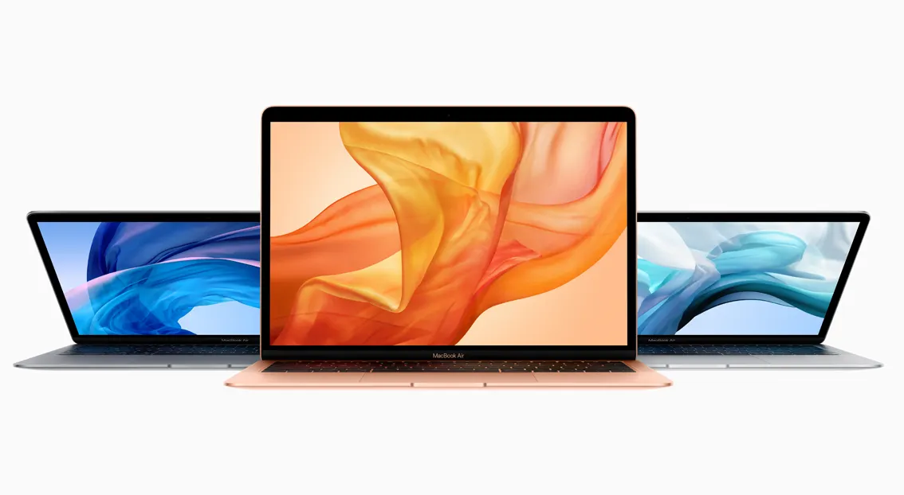

2. Gaming Laptops: Gaming laptops have generally thick as compared to other laptops. Because it houses more powerful components which produce more heat in order to cool them it needs big heat pipes and ventilation system. Gaming laptops generally comes with i5, i7, and i9 H series of processors from Intel and R5 and R7 processors from AMD. It must have dedicated GPUs for maximum frame rates in modern games. And they might have high refresh rate display panels like 120Hz, 144Hz. But this much horsepower comes with heavyweight, less battery life, Bulkiness, etc. So mind that.

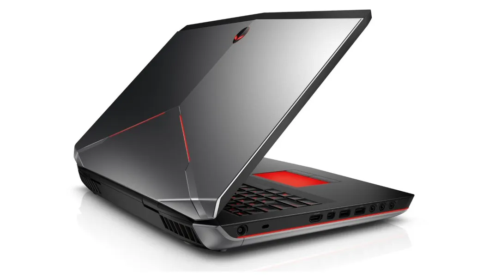

3. Convertible Laptop: These laptops are between the UltraBooks and Gaming Laptops. They weigh slightly more than UltraBooks, they might cost more than similarly speced UltraBook because of 360-degree rotation functionality. But they can be used as a tablet if you want one.

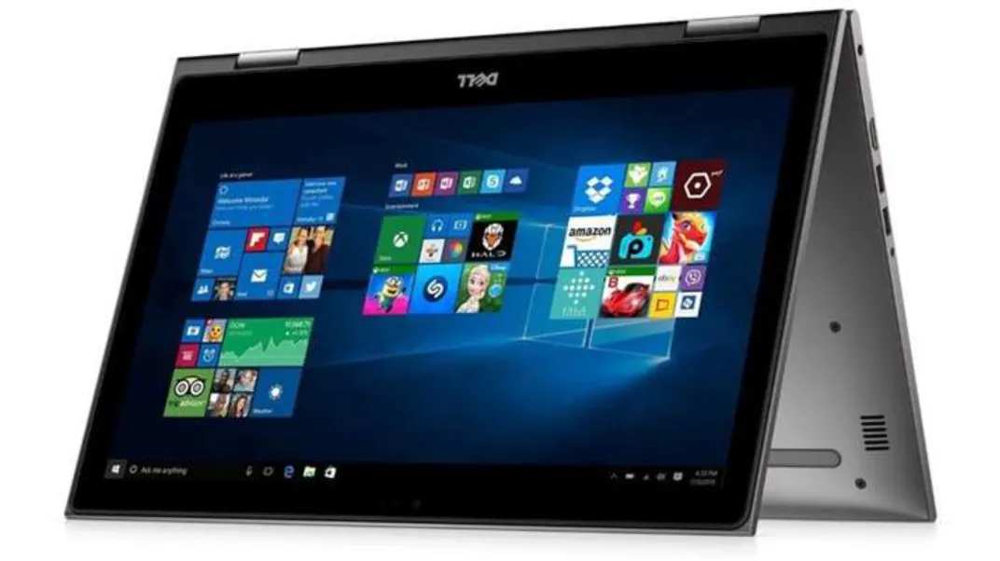

#### Platform (Operating Systems)

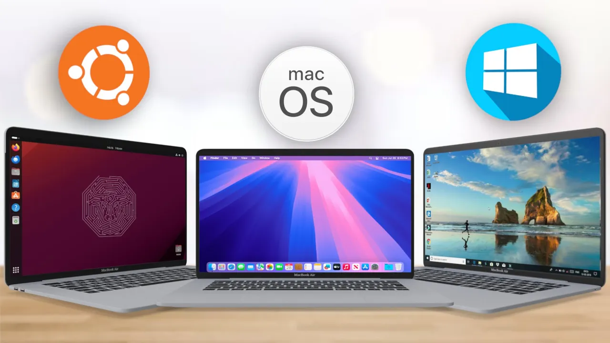

As we all know there are two platforms or you can say the Operating system divides the all computer market in two parts Windows and MacOs. This is a very deep topic for discussion. So I will put the link to that article below. Or you can watch some videos on the internet about Mac Vs PC or Windows vs MacOS. Or just put Linux on any of them! It’s your choice.

That’s it now you can buy a nice laptop on your own according to your use case. You can contact me on my email. Thank You!

*Original Article by Ishan Jawade [ishanjawade@outlook.com] on Medium.com*